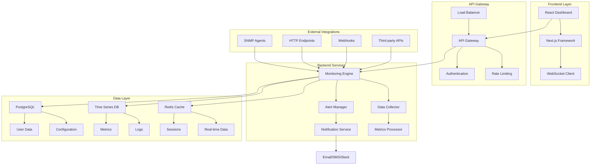
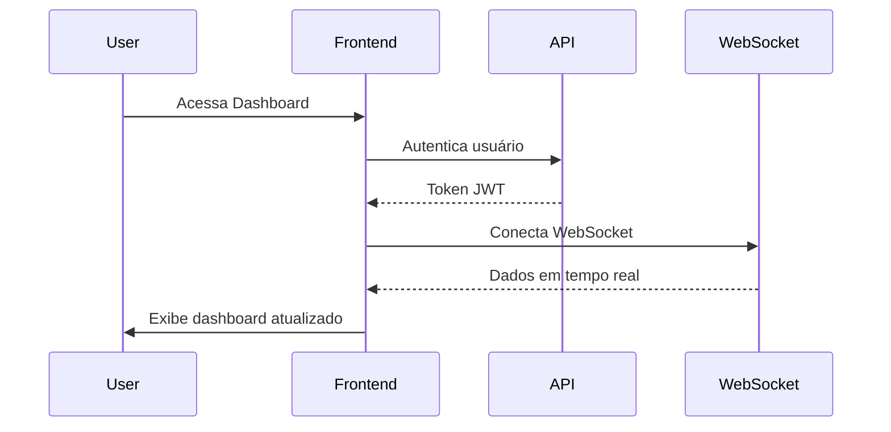
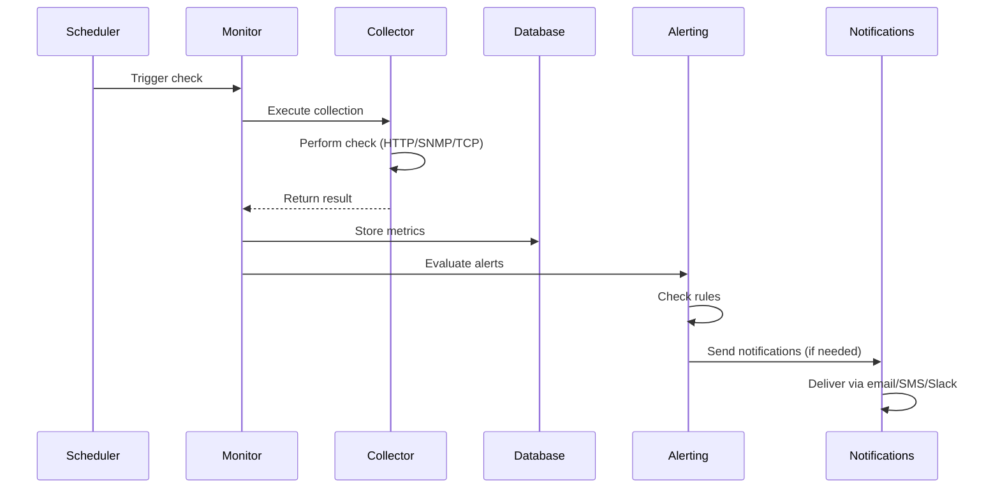
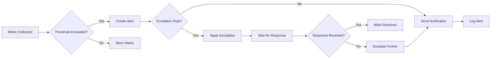

# Arquitetura do Sistema

Esta seção detalha a arquitetura técnica do InfraWatch, explicando como os componentes interagem para fornecer monitoramento robusto e escalável.

## Visão Geral da Arquitetura



## Componentes Principais

### Frontend (React/Next.js)

O frontend é uma aplicação React moderna construída com Next.js, oferecendo:

#### Características Técnicas
- **Framework**: Next.js 14 com App Router
- **UI Library**: Tailwind CSS + shadcn/ui
- **State Management**: Zustand para estado global
- **Real-time**: WebSocket para atualizações em tempo real
- **Charts**: Recharts para visualizações

#### Estrutura de Componentes

```
frontend/infrawatch/src/
├── app/
│   ├── dashboard/          # Páginas do dashboard
│   ├── login/             # Autenticação
│   └── layout.tsx         # Layout principal
├── components/
│   ├── ui/                # Componentes base
│   ├── charts/            # Gráficos e visualizações
│   └── forms/             # Formulários
└── lib/
    ├── api.ts             # Cliente da API
    ├── websocket.ts       # Conexão WebSocket
    └── utils.ts           # Utilitários
```

#### Fluxo de Dados



### Backend (Node.js/Express)

O backend é construído com Node.js e Express, fornecendo APIs RESTful e WebSocket.

#### Arquitetura em Camadas

```
api/
├── src/
│   ├── controllers/       # Controladores da API
│   ├── services/          # Lógica de negócio
│   ├── models/            # Modelos de dados
│   ├── middleware/        # Middlewares
│   ├── routes/            # Definição de rotas
│   └── utils/             # Utilitários
├── config/
│   ├── database.js        # Configuração do BD
│   └── monitoring.js      # Config. monitoramento
└── tests/                 # Testes automatizados
```

#### Serviços Principais

=== "Monitoring Engine"
    ```javascript
    class MonitoringEngine {
      constructor() {
        this.activeChecks = new Map();
        this.scheduler = new CronScheduler();
      }
      
      async startMonitoring(service) {
        const check = new ServiceCheck(service);
        this.activeChecks.set(service.id, check);
        this.scheduler.schedule(service.interval, () => {
          this.executeCheck(check);
        });
      }
      
      async executeCheck(check) {
        const result = await check.run();
        await this.processResult(result);
      }
    }
    ```

=== "Alert Manager"
    ```javascript
    class AlertManager {
      constructor() {
        this.rules = new RuleEngine();
        this.notifier = new NotificationService();
      }
      
      async processAlert(metric) {
        const alerts = await this.rules.evaluate(metric);
        
        for (const alert of alerts) {
          await this.notifier.send(alert);
          await this.logAlert(alert);
        }
      }
    }
    ```

=== "Data Collector"
    ```javascript
    class DataCollector {
      async collect(source, config) {
        switch (source.type) {
          case 'http':
            return await this.httpCheck(config);
          case 'snmp':
            return await this.snmpCheck(config);
          case 'tcp':
            return await this.tcpCheck(config);
          default:
            throw new Error(`Unsupported source: ${source.type}`);
        }
      }
    }
    ```

### Banco de Dados

#### PostgreSQL (Dados Relacionais)

Armazena dados estruturados e configurações:

```sql
-- Estrutura principal das tabelas
CREATE TABLE users (
    id SERIAL PRIMARY KEY,
    email VARCHAR(255) UNIQUE NOT NULL,
    password_hash VARCHAR(255) NOT NULL,
    role VARCHAR(50) DEFAULT 'user',
    created_at TIMESTAMP DEFAULT NOW()
);

CREATE TABLE services (
    id SERIAL PRIMARY KEY,
    name VARCHAR(255) NOT NULL,
    type VARCHAR(50) NOT NULL,
    config JSONB NOT NULL,
    status VARCHAR(20) DEFAULT 'unknown',
    last_check TIMESTAMP,
    created_at TIMESTAMP DEFAULT NOW()
);

CREATE TABLE alert_rules (
    id SERIAL PRIMARY KEY,
    service_id INTEGER REFERENCES services(id),
    condition JSONB NOT NULL,
    severity VARCHAR(20) NOT NULL,
    enabled BOOLEAN DEFAULT true
);
```

#### Time Series Database (InfluxDB/TimescaleDB)

Para métricas e dados temporais:

```sql
-- Extensão TimescaleDB no PostgreSQL
CREATE EXTENSION IF NOT EXISTS timescaledb;

-- Tabela de métricas
CREATE TABLE metrics (
    time TIMESTAMPTZ NOT NULL,
    service_id INTEGER NOT NULL,
    metric_name VARCHAR(100) NOT NULL,
    value DOUBLE PRECISION,
    tags JSONB
);

-- Converter para hypertable
SELECT create_hypertable('metrics', 'time');

-- Políticas de retenção
SELECT add_retention_policy('metrics', INTERVAL '1 year');
```

#### Redis (Cache e Sessões)

```javascript
// Configuração do Redis
const redis = new Redis({
  host: process.env.REDIS_HOST,
  port: process.env.REDIS_PORT,
  retryDelayOnFailover: 100,
  maxRetriesPerRequest: 3
});

// Cache de métricas
await redis.setex(`metrics:${serviceId}`, 300, JSON.stringify(data));

// Sessões de usuário
await redis.setex(`session:${token}`, 3600, userId);
```

## Fluxos de Dados

### Fluxo de Monitoramento



### Fluxo de Alertas



## Agentes de Monitoramento

### Arquitetura dos Agentes

```python
# Estrutura do agente Python
class MonitoringAgent:
    def __init__(self, config):
        self.config = config
        self.api_client = APIClient(config.api_url)
        self.collectors = self._init_collectors()
    
    def _init_collectors(self):
        return {
            'system': SystemCollector(),
            'network': NetworkCollector(),
            'application': ApplicationCollector()
        }
    
    async def run_monitoring_cycle(self):
        for collector_name, collector in self.collectors.items():
            try:
                metrics = await collector.collect()
                await self.api_client.send_metrics(metrics)
            except Exception as e:
                logger.error(f"Error in {collector_name}: {e}")
```

### Tipos de Coletores

=== "System Collector"
    ```python
    class SystemCollector:
        def collect(self):
            return {
                'cpu_usage': psutil.cpu_percent(),
                'memory_usage': psutil.virtual_memory().percent,
                'disk_usage': psutil.disk_usage('/').percent,
                'load_average': os.getloadavg()
            }
    ```

=== "Network Collector"
    ```python
    class NetworkCollector:
        def collect(self):
            stats = psutil.net_io_counters()
            return {
                'bytes_sent': stats.bytes_sent,
                'bytes_recv': stats.bytes_recv,
                'packets_sent': stats.packets_sent,
                'packets_recv': stats.packets_recv
            }
    ```

=== "Application Collector"
    ```python
    class ApplicationCollector:
        def collect(self):
            processes = []
            for proc in psutil.process_iter(['pid', 'name', 'cpu_percent']):
                if proc.info['name'] in self.monitored_processes:
                    processes.append(proc.info)
            return {'processes': processes}
    ```

## Escalabilidade e Performance

### Estratégias de Escalabilidade

#### Horizontal Scaling

```yaml
# Kubernetes deployment
apiVersion: apps/v1
kind: Deployment
metadata:
  name: infrawatch-backend
spec:
  replicas: 3
  selector:
    matchLabels:
      app: infrawatch-backend
  template:
    spec:
      containers:
      - name: backend
        image: infrawatch/backend:latest
        resources:
          requests:
            memory: "512Mi"
            cpu: "500m"
          limits:
            memory: "1Gi"
            cpu: "1000m"
```

#### Load Balancing

```nginx
upstream infrawatch_backend {
    least_conn;
    server backend1:3001 weight=1 max_fails=3 fail_timeout=30s;
    server backend2:3001 weight=1 max_fails=3 fail_timeout=30s;
    server backend3:3001 weight=1 max_fails=3 fail_timeout=30s;
}

server {
    location /api {
        proxy_pass http://infrawatch_backend;
        proxy_set_header Host $host;
        proxy_set_header X-Real-IP $remote_addr;
    }
}
```

### Otimizações de Performance

#### Database Indexing

```sql
-- Índices para queries frequentes
CREATE INDEX idx_metrics_service_time ON metrics(service_id, time DESC);
CREATE INDEX idx_services_status ON services(status);
CREATE INDEX idx_alerts_created_at ON alerts(created_at DESC);

-- Particionamento por tempo
SELECT add_dimension('metrics', 'service_id', number_partitions => 4);
```

#### Caching Strategy

```javascript
// Cache em múltiplas camadas
class CacheManager {
  constructor() {
    this.l1Cache = new Map(); // Memory cache
    this.l2Cache = redis;     // Redis cache
  }
  
  async get(key) {
    // L1 Cache
    if (this.l1Cache.has(key)) {
      return this.l1Cache.get(key);
    }
    
    // L2 Cache
    const value = await this.l2Cache.get(key);
    if (value) {
      this.l1Cache.set(key, value);
      return value;
    }
    
    return null;
  }
}
```

## Segurança

### Autenticação e Autorização

```javascript
// JWT Authentication
const jwt = require('jsonwebtoken');

class AuthService {
  generateToken(user) {
    return jwt.sign(
      { userId: user.id, role: user.role },
      process.env.JWT_SECRET,
      { expiresIn: '24h' }
    );
  }
  
  verifyToken(token) {
    return jwt.verify(token, process.env.JWT_SECRET);
  }
}

// RBAC Middleware
const authorize = (roles) => {
  return (req, res, next) => {
    if (!roles.includes(req.user.role)) {
      return res.status(403).json({ error: 'Forbidden' });
    }
    next();
  };
};
```

### Comunicação Segura

```javascript
// HTTPS Configuration
const https = require('https');
const fs = require('fs');

const options = {
  key: fs.readFileSync('private-key.pem'),
  cert: fs.readFileSync('certificate.pem')
};

https.createServer(options, app).listen(443);

// API Rate Limiting
const rateLimit = require('express-rate-limit');

const limiter = rateLimit({
  windowMs: 15 * 60 * 1000, // 15 minutes
  max: 100, // limit each IP to 100 requests per windowMs
  message: 'Too many requests from this IP'
});
```

## Monitoramento do Sistema

### Health Checks

```javascript
// Sistema de health checks
app.get('/health', async (req, res) => {
  const health = {
    status: 'ok',
    timestamp: new Date().toISOString(),
    services: {
      database: await checkDatabase(),
      redis: await checkRedis(),
      external_apis: await checkExternalAPIs()
    }
  };
  
  const isHealthy = Object.values(health.services)
    .every(service => service.status === 'ok');
  
  res.status(isHealthy ? 200 : 503).json(health);
});
```

### Métricas Internas

```javascript
// Prometheus metrics
const prometheus = require('prom-client');

const httpRequestDuration = new prometheus.Histogram({
  name: 'http_request_duration_seconds',
  help: 'Duration of HTTP requests in seconds',
  labelNames: ['method', 'route', 'status']
});

const activeConnections = new prometheus.Gauge({
  name: 'websocket_connections_active',
  help: 'Number of active WebSocket connections'
});
```

---

Esta arquitetura garante que o InfraWatch seja escalável, seguro e performático, capaz de monitorar infraestruturas de qualquer tamanho com alta disponibilidade e confiabilidade.