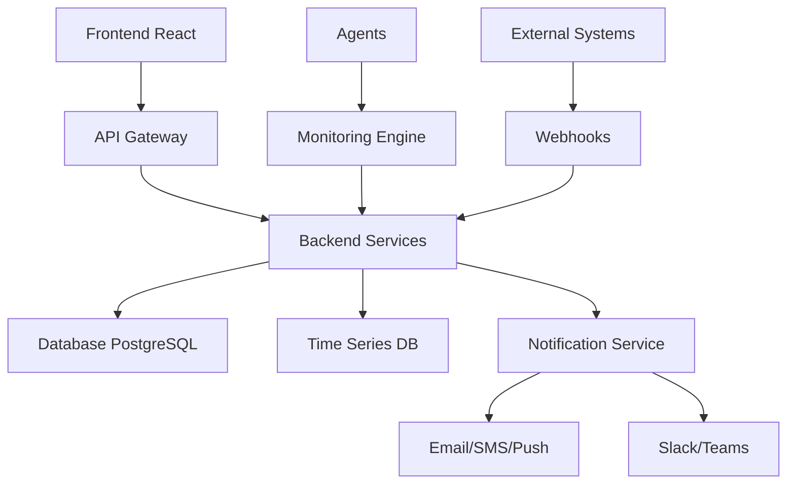

# InfraWatch

  
  <h2>Plataforma de Monitoramento de Infraestrutura Corporativa</h2>
  
<em>Visibilidade completa, controle total da sua infraestrutura tecnológica</em>

---

## Visão Geral

O **InfraWatch** é uma solução moderna de monitoramento de infraestruturas corporativas que centraliza a observação de múltiplos serviços e sistemas organizacionais. Oferece visibilidade em tempo real sobre redes, servidores, aplicações e endpoints, garantindo alta disponibilidade dos serviços críticos.

!!! success "Objetivo Principal"
    Criar uma plataforma unificada que permite às organizações monitorar proativamente sua infraestrutura tecnológica, antecipando falhas e otimizando tempos de resposta.

## Funcionalidades Principais

### Monitoramento Multifonte
- **Conectividade diversificada**: API, SNMP, ping, webhook
- **Detecção automática** de mudanças de estado (up/down)
- **Coleta em tempo real** com intervalos personalizáveis

### Dashboards Inteligentes
- Interface responsiva e intuitiva
- Indicadores visuais em tempo real
- Métricas de uptime e disponibilidade
- Relatórios de SLA automatizados

### Sistema de Alertas
- Notificações multicanal (e-mail, SMS, push)
- Níveis de criticidade personalizáveis
- Regras de escalonamento inteligentes
- Integração com Slack, Teams, WhatsApp

### Análise Histórica
- Armazenamento de logs e métricas
- Relatórios de tendências
- Análise de incidentes
- Projeções baseadas em dados

## Arquitetura do Sistema

## Casos de Uso

=== "Detecção de Falha Crítica"
    
    **Cenário**: Servidor ERP-PROD indisponível
    
    1. Sistema detecta automaticamente
    2. Dashboard exibe alerta vermelho
    3. Notificação enviada ao responsável
    4. Log detalhado registrado

=== "Monitoramento de SLA"
    
    **Cenário**: Acompanhamento de Kiosks Self-Service
    
    - Tracking de uptime (99.3% atual)
    - Registro de 3 falhas no período
    - Relatório de impacto no SLA
    - Projeções baseadas em histórico

## Benefícios Organizacionais

### Operacionais
- **Proatividade**: Detecção precoce de problemas
- **Eficiência**: Redução do tempo de resolução
- **Centralização**: Visão unificada da infraestrutura
- **Automatização**: Menos verificações manuais

### Estratégicos
- **Compliance**: Monitoramento automático de SLA
- **Planejamento**: Decisões baseadas em dados
- **Otimização**: Identificação de melhorias
- **Transparência**: Visibilidade para gestão

## Integrações Suportadas

| Protocolo | Descrição | Uso |
|-----------|-----------|-----|
| **REST/GraphQL** | APIs modernas | Serviços web |
| **SNMP** | Protocolo de rede | Equipamentos tradicionais |
| **ICMP Ping** | Conectividade básica | Verificação de rede |
| **Webhooks** | Integração bidirecional | Sistemas externos |

### Ferramentas de Gestão
- **GLPI**: Gestão de ativos
- **DocuWare**: Gestão documental
- **Sistemas ERP**: Processos de negócio
- **Plataformas de Chat**: Slack, Teams

## Começar Agora

!!! tip "Próximos Passos"
    1. Leia o [Guia de Instalação](instalacao.md)
    2. Entenda a [Arquitetura](arquitetura.md)
    3. Consulte o [Manual de Uso](uso.md)
    4. Explore a [API](api.md)

## Suporte

Precisa de ajuda? Consulte nossa seção de [Suporte](faq.md) ou entre em contato:

- **Email**: suporte@rcs-angola.com
- **Chat**: Disponível no dashboard
- **WhatsApp**: +244 XXX XXX XXX

---

  
<strong>InfraWatch</strong> - Desenvolvido pela RCS Angola

  
<em>Transformando a gestão de infraestrutura através da inovação</em>

